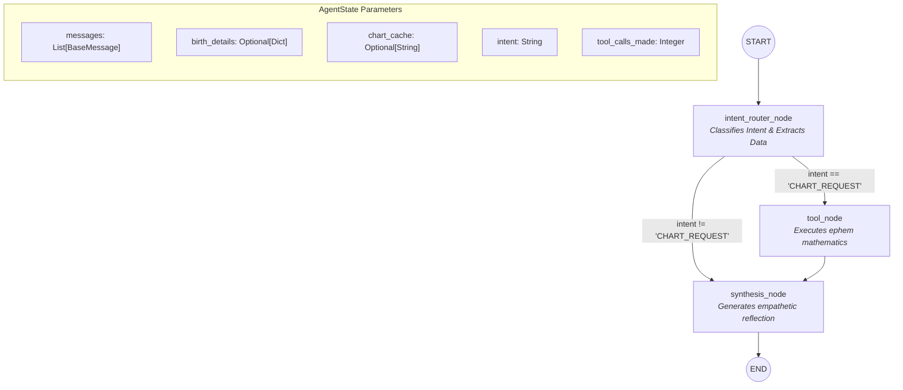

# ✦ AstroAgent: Aradhana

An elite, production-grade spiritual companion powered by Agentic AI (LangGraph), deterministic astrological ephemeris mathematics (`ephem`), and a deeply skeuomorphic React frontend.

Aradhana fuses the ancient wisdom of celestial positioning with cutting-edge LLM state machine orchestration to provide deeply empathetic, non-deterministic spiritual reflections.

## Quick Start
**Backend (FastAPI + LangGraph):**
```bash
cd backend
python -m uvicorn main:app --host 0.0.0.0 --port 8000
```

**Frontend (React + Vite):**
```bash
cd frontend
npm run dev
```

**Evaluation Harness:**
```bash
cd eval_harness
python runner.py
```

---

## 1. Architecture Deep-Dive

AstroAgent leverages **LangGraph** to maintain a persistent `AgentState` machine. The graph strictly controls the flow of conversation, intent extraction, tool execution, and synthesis to prevent hallucinations and enforce safety boundaries.

### The LangGraph State Machine



---

## 2. Detailed API & SSE Stream Specifications

Aradhana streams responses directly to the frontend using Server-Sent Events (SSE). This allows the UI to render intermediate states (like tool execution) while the LLM generates tokens.

### `POST /api/chat/stream`

**Expected JSON Payload:**
```json
{
  "message": "Please read my birth chart. I was born on 1990-05-15 at 14:30...",
  "thread_id": "optional-uuid-for-continuity",
  "birth_details": {
    "date": "1990-05-15",
    "time": "14:30",
    "latitude": 34.0522,
    "longitude": -118.2437,
    "timezone": "America/Los_Angeles"
  }
}
```

**Raw SSE Event Trace Example (Tool Triggered):**
```http
event: processing_start
data: {"thread_id": "uuid", "status": "Consulting the celestial records..."}

event: tool_start
data: {"tool": "compute_birth_chart", "status": "running"}

event: intent_classified
data: {"intent": "CHART_REQUEST", "phase": "routing"}

event: tool_end
data: {"tool": "compute_birth_chart", "status": "complete"}

event: token
data: {"token": "The "}

event: token
data: {"token": "stars "}

event: done
data: {"thread_id": "uuid", "phase": "done", "tool_calls_made": 1, "chart_available": true, "intent": "CHART_REQUEST"}
```

---

## 3. Operational Trade-offs & Limitations

Building a deterministic math engine alongside a probabilistic LLM requires strict engineering trade-offs:

*   **Ephemeris Compute Overhead:** Initializing the `ephem` context and computing precise ecliptic longitudes for 10 celestial bodies adds approximately ~150-300ms of latency per execution. We trade raw speed for deterministic mathematical accuracy (avoiding LLM hallucinations of planetary positions).
*   **Geo-Coordinate Resolution Constraints:** The system expects explicit floating-point latitude and longitude. Edge cases in ambiguous place names (e.g., "Springfield") without strict coordinate mapping will fail. The frontend enforces strict coordinate inputs to mitigate this.
*   **State Volatility:** The current `thread_store` maintains conversational state natively in Python memory (`dict`). 
    *   *Trade-off:* Lightning-fast read/writes during the session.
    *   *Limitation:* If the FastAPI process restarts or scales horizontally across workers, active sessions will be lost. For a distributed production setup, this must be migrated to a `RedisSaver` (LangGraph checkpointing).
